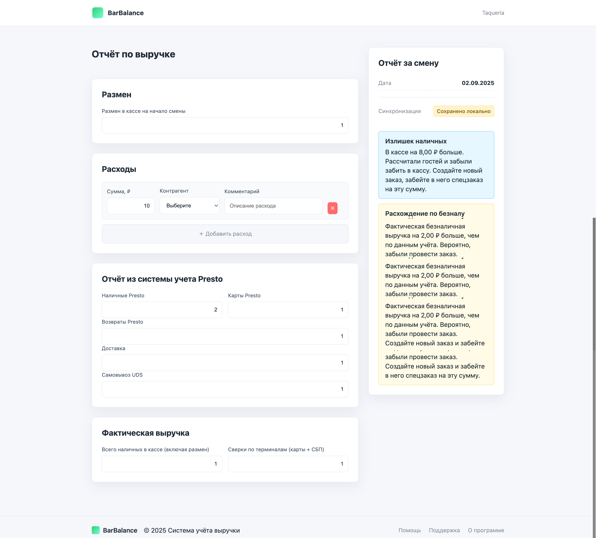

# PRD v2: Доработка сервиса отчетов

## 1. Введение

Этот документ описывает второй этап доработок для онлайн-формы отчета по смене. Основная цель - улучшить пользовательский интерфейс, добавить ключевую информацию для быстрой идентификации и повысить информативность сводки.

## 2. Новые требования

### 2.1. Глобальный Хедер

**Описание:**
На всех страницах приложения должен появиться глобальный хедер.

**Визуальные компоненты:**
- **Слева:** Название приложения — "BarBalance".
- **Справа:** Название заведения.

**Логика:**
- Название заведения должно загружаться из файла `config.json` из параметра `barName`.
- Хедер должен быть "липким" (sticky) и всегда оставаться вверху экрана при прокрутке.

**Пример из макета:**


### 2.2. Бизнес-дата в сводке

**Описание:**
В блок "Сводка за смену" необходимо добавить отображение текущей бизнес-даты.

**Визуальные компоненты:**
- **Поле:** "Дата"
- **Значение:** Текущая бизнес-дата в формате `ДД.ММ.ГГГГ`.

**Логика:**
- Бизнес-дата рассчитывается на основе параметров `businessDate.changeTime` и `businessDate.timezone` из `config.json`, как и ранее.
- Дата должна быть видна в самом верху блока сводки.

**Пример из макета:**


## 3. Обновления в конфигурации

В файл `config.json` добавлен новый ключ `barName` для хранения названия заведения.

**Пример `config.json`:**
```json
{
  "barName": "Taqueria",
  "webhookUrl": "URL_вашего_вебхука_в_n8n",
  "businessDate": {
    "changeTime": "09:00",
    "timezone": "Asia/Irkutsk"
  },
  // ... остальные параметры
}
```
